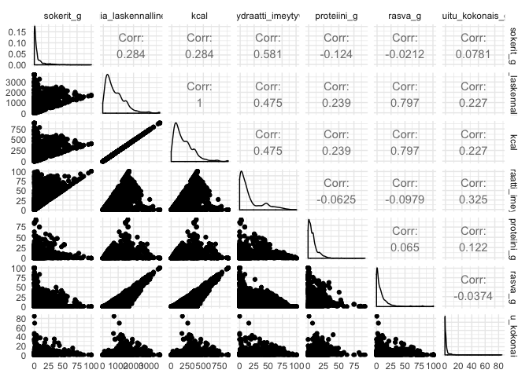

### Optimizing

https://fineli.fi/fineli/fi/elintarvikkeet 

FIN:
Mahdollisimman vähäsokerinen 7 pv:n ruokavalioehdotus seuraavilla spekseillä: 
- kokonaisuus mahdollisimman tarkkaan 2000 kcal/pv
- energiasta 50% hiilareista, 30% proteiineista, 20% rasvoista mahdollisimman tarkkaan
- kuitua vähintään 20 g/pv 
- ei samasta ruokaryhmästä (esim. “ateriasalaatti” tai “hampurilainen”) peräkkäisinä päivinä
- vähintään 5 eri ruoka-ainetta per päivä

ENG:
Lowest possible amount of sugar in the 7 days diet with following conditions:
- energy intake 2000 kcal/day
- of which 50 % should be carbohydrates, 30% protein, 20% fat
- at least 20g/day fibers
- on the following days, no items from the same foodgroup
- at least 5 different items per day


```r
library(readr)
library(dplyr)
library(tidyverse)

options(encoding = "UTF-8", scipen = 999)
Sys.getlocale()
```

```
## [1] "fi_FI.UTF-8/fi_FI.UTF-8/fi_FI.UTF-8/C/fi_FI.UTF-8/fi_FI.UTF-8"
```

```r
#Sys.setlocale("fi_FI.UTF-8/fi_FI.UTF-8/fi_FI.UTF-8/C/fi_FI.UTF-8/fi_FI.UTF-8") #ääkköset

elintarvikkeet <- read_delim("https://fineli.fi/fineli/fi/elintarvikkeet/resultset.csv", 
        ";", escape_double = FALSE, 
        locale = locale("fi", decimal_mark=".",
        asciify = TRUE), 
    na = "N/A", trim_ws = TRUE) %>%  
  mutate_all(funs(str_replace(., "<", "")))%>%
  mutate_at(vars(-"name"),  as.numeric)

summary(elintarvikkeet)
```

```
##        id            name           energia, laskennallinen (kJ)
##  Min.   :    1   Length:4098        Min.   :   0.0              
##  1st Qu.: 7176   Class :character   1st Qu.: 330.0              
##  Median :31572   Mode  :character   Median : 644.0              
##  Mean   :22951                      Mean   : 813.6              
##  3rd Qu.:33066                      3rd Qu.:1143.8              
##  Max.   :35566                      Max.   :3700.0              
##                                                                 
##  hiilihydraatti imeytyvä (g)   rasva (g)       proteiini (g)   
##  Min.   :  0.00              Min.   :  0.000   Min.   : 0.000  
##  1st Qu.:  3.40              1st Qu.:  1.400   1st Qu.: 2.400  
##  Median :  9.70              Median :  4.900   Median : 5.600  
##  Mean   : 18.24              Mean   :  9.389   Mean   : 7.816  
##  3rd Qu.: 25.20              3rd Qu.: 11.175   3rd Qu.:10.400  
##  Max.   :100.00              Max.   :100.000   Max.   :92.500  
##                                                NA's   :1       
##   alkoholi (g)      kuitu, kokonais- (g) orgaaniset hapot (g)
##  Min.   : 0.00000   Min.   : 0.000       Min.   : 0.0000     
##  1st Qu.: 0.00000   1st Qu.: 0.100       1st Qu.: 0.0000     
##  Median : 0.00000   Median : 1.000       Median : 0.1000     
##  Mean   : 0.07082   Mean   : 2.035       Mean   : 0.2412     
##  3rd Qu.: 0.00000   3rd Qu.: 2.200       3rd Qu.: 0.3000     
##  Max.   :33.00000   Max.   :85.000       Max.   :10.0000     
##  NA's   :3          NA's   :1            NA's   :235         
##  sokerialkoholi (g) tärkkelys (g)    sokerit (g)      fruktoosi (g)    
##  Min.   : -1.0000   Min.   : 0.00   Min.   :  0.000   Min.   : 0.0000  
##  1st Qu.:  0.0000   1st Qu.: 0.10   1st Qu.:  0.800   1st Qu.: 0.1000  
##  Median :  0.0000   Median : 3.60   Median :  2.500   Median : 0.1000  
##  Mean   :  0.1563   Mean   :11.51   Mean   :  6.647   Mean   : 0.7966  
##  3rd Qu.:  0.0000   3rd Qu.:15.30   3rd Qu.:  6.900   3rd Qu.: 0.6000  
##  Max.   :100.0000   Max.   :97.00   Max.   :100.000   Max.   :99.8000  
##  NA's   :178        NA's   :3                         NA's   :42       
##  galaktoosi (g)     glukoosi (g)       laktoosi (g)      maltoosi (g)  
##  Min.   : 0.0000   Min.   :  0.0000   Min.   : 0.0000   Min.   : 0.00  
##  1st Qu.: 0.0000   1st Qu.:  0.1000   1st Qu.: 0.0000   1st Qu.: 0.00  
##  Median : 0.0000   Median :  0.2000   Median : 0.0000   Median : 0.00  
##  Mean   : 0.1383   Mean   :  0.8824   Mean   : 0.7158   Mean   : 0.11  
##  3rd Qu.: 0.1000   3rd Qu.:  0.9000   3rd Qu.: 0.5000   3rd Qu.: 0.10  
##  Max.   :21.0000   Max.   :100.0000   Max.   :78.0000   Max.   :10.90  
##  NA's   :487       NA's   :47         NA's   :10        NA's   :46     
##  sakkaroosi (g)   polysakkaridi, vesiliukoinen ei-selluloosa (g)
##  Min.   : 0.000   Min.   : 0.0000                               
##  1st Qu.: 0.100   1st Qu.: 0.1000                               
##  Median : 0.300   Median : 0.2000                               
##  Mean   : 3.982   Mean   : 0.3986                               
##  3rd Qu.: 2.800   3rd Qu.: 0.5000                               
##  Max.   :99.900   Max.   :47.1000                               
##  NA's   :35       NA's   :101                                   
##  kuitu veteen liukenematon (g) rasvahapot yhteensä (g)
##  Min.   : 0.000                Min.   : 0.000         
##  1st Qu.: 0.100                1st Qu.: 1.100         
##  Median : 0.600                Median : 4.400         
##  Mean   : 1.168                Mean   : 8.759         
##  3rd Qu.: 1.300                3rd Qu.:10.300         
##  Max.   :62.700                Max.   :99.700         
##  NA's   :101                   NA's   :27             
##  rasvahapot monityydyttymättömät (g)
##  Min.   : 0.000                     
##  1st Qu.: 0.200                     
##  Median : 0.800                     
##  Mean   : 1.822                     
##  3rd Qu.: 1.800                     
##  Max.   :66.000                     
##  NA's   :29                         
##  rasvahapot yksittäistyydyttymättömät cis (g) rasvahapot tyydyttyneet (g)
##  Min.   : 0.000                               Min.   : 0.000             
##  1st Qu.: 0.300                               1st Qu.: 0.300             
##  Median : 1.700                               Median : 1.400             
##  Mean   : 3.548                               Mean   : 3.273             
##  3rd Qu.: 4.300                               3rd Qu.: 3.700             
##  Max.   :70.600                               Max.   :91.300             
##  NA's   :34                                   NA's   :28                 
##  rasvahapot trans (g) rasvahapot n-3 monityydyttymättömät (g)
##  Min.   :0.0000       Min.   : 0.0000                        
##  1st Qu.:0.0000       1st Qu.: 0.1000                        
##  Median :0.1000       Median : 0.1000                        
##  Mean   :0.1158       Mean   : 0.4571                        
##  3rd Qu.:0.1000       3rd Qu.: 0.4000                        
##  Max.   :4.9000       Max.   :53.3000                        
##  NA's   :51           NA's   :40                             
##  rasvahapot n-6 monityydyttymättömät (g)
##  Min.   : 0.000                         
##  1st Qu.: 0.100                         
##  Median : 0.600                         
##  Mean   : 1.365                         
##  3rd Qu.: 1.300                         
##  Max.   :62.300                         
##  NA's   :37                             
##  rasvahappo 18:2 cis,cis n-6 (linolihappo) (mg)
##  Min.   :    0.0                               
##  1st Qu.:  117.0                               
##  Median :  531.5                               
##  Mean   : 1253.7                               
##  3rd Qu.: 1271.5                               
##  Max.   :62280.0                               
##  NA's   :74                                    
##  rasvahappo 18:3 n-3 (alfalinoleenihappo) (mg)
##  Min.   :    0.0                              
##  1st Qu.:   25.0                              
##  Median :   96.0                              
##  Mean   :  336.2                              
##  3rd Qu.:  276.0                              
##  Max.   :53300.0                              
##  NA's   :75                                   
##  rasvahappo 20:5 n-3 (EPA) (mg) rasvahappo 22:6 n-3 (DHA) (mg)
##  Min.   :   0.00                Min.   :   0.00               
##  1st Qu.:   0.00                1st Qu.:   0.00               
##  Median :   0.00                Median :   0.00               
##  Mean   :  16.71                Mean   :  36.64               
##  3rd Qu.:   0.00                3rd Qu.:   5.00               
##  Max.   :1480.00                Max.   :3350.00               
##  NA's   :59                     NA's   :59                    
##  kolesteroli (GC) (mg) sterolit (mg)      kalsium (mg)     
##  Min.   :   0.00       Min.   :   0.00   Min.   :    0.00  
##  1st Qu.:   0.10       1st Qu.:   4.10   1st Qu.:   13.70  
##  Median :   7.20       Median :  16.80   Median :   30.50  
##  Mean   :  27.79       Mean   :  36.62   Mean   :   72.77  
##  3rd Qu.:  38.35       3rd Qu.:  41.75   3rd Qu.:   87.90  
##  Max.   :2680.80       Max.   :7500.00   Max.   :11300.00  
##  NA's   :22            NA's   :167       NA's   :13        
##    rauta (mg)     jodidi (jodi) (µg)  kalium (mg)      magnesium (mg)   
##  Min.   : 0.000   Min.   :     0.0   Min.   :    0.0   Min.   :   0.00  
##  1st Qu.: 0.300   1st Qu.:     3.4   1st Qu.:  134.6   1st Qu.:  11.70  
##  Median : 0.700   Median :    12.3   Median :  197.0   Median :  18.00  
##  Mean   : 1.317   Mean   :   130.1   Mean   :  252.7   Mean   :  29.95  
##  3rd Qu.: 1.300   3rd Qu.:    21.7   3rd Qu.:  304.4   3rd Qu.:  28.00  
##  Max.   :89.800   Max.   :429000.0   Max.   :17880.0   Max.   :1100.00  
##  NA's   :15       NA's   :118        NA's   :16        NA's   :16       
##   natrium (mg)        suola (mg)       fosfori (mg)     seleeni (µg)    
##  Min.   :    0.00   Min.   :    0.0   Min.   :   0.0   Min.   :   0.00  
##  1st Qu.:   43.05   1st Qu.:  109.7   1st Qu.:  51.3   1st Qu.:   1.50  
##  Median :  208.50   Median :  531.1   Median :  96.0   Median :   4.70  
##  Mean   :  351.10   Mean   :  894.4   Mean   : 127.1   Mean   :   8.47  
##  3rd Qu.:  397.45   3rd Qu.: 1011.9   3rd Qu.: 156.5   3rd Qu.:   9.40  
##  Max.   :38700.00   Max.   :98607.6   Max.   :8400.0   Max.   :1917.00  
##  NA's   :3                            NA's   :15       NA's   :16       
##   sinkki (mg)     tryptofaani (mg) folaatti, kokonais- (µg)
##  Min.   : 0.000   Min.   :   0.0   Min.   :   0.00         
##  1st Qu.: 0.300   1st Qu.:  28.0   1st Qu.:   5.60         
##  Median : 0.600   Median :  69.3   Median :  12.65         
##  Mean   : 1.091   Mean   :  98.5   Mean   :  25.80         
##  3rd Qu.: 1.300   3rd Qu.: 126.9   3rd Qu.:  26.43         
##  Max.   :17.800   Max.   :1800.0   Max.   :1435.60         
##  NA's   :17       NA's   :80       NA's   :6               
##  niasiiniekvivalentti NE (mg)
##  Min.   : 0.000              
##  1st Qu.: 0.800              
##  Median : 1.800              
##  Mean   : 2.993              
##  3rd Qu.: 3.900              
##  Max.   :28.700              
##  NA's   :14                  
##  niasiini (nikotiinihappo + nikotiiniamidi) (mg)
##  Min.   : 0.000                                 
##  1st Qu.: 0.200                                 
##  Median : 0.700                                 
##  Mean   : 1.696                                 
##  3rd Qu.: 2.100                                 
##  Max.   :28.200                                 
##  NA's   :14                                     
##  pyridoksiini vitameerit (vetykloridi) (B6) (mg) riboflaviini (B2) (mg)
##  Min.   :0.0000                                  Min.   :0.000         
##  1st Qu.:0.0500                                  1st Qu.:0.050         
##  Median :0.1000                                  Median :0.100         
##  Mean   :0.1643                                  Mean   :0.147         
##  3rd Qu.:0.2000                                  3rd Qu.:0.170         
##  Max.   :2.6200                                  Max.   :9.000         
##  NA's   :13                                      NA's   :12            
##  tiamiini (B1) (mg) B12-vitamiini (kobalamiini) (µg) C-vitamiini (mg) 
##  Min.   :0.0000     Min.   :  0.0000                 Min.   :  0.000  
##  1st Qu.:0.0300     1st Qu.:  0.0000                 1st Qu.:  0.000  
##  Median :0.0600     Median :  0.2000                 Median :  0.800  
##  Mean   :0.1144     Mean   :  0.7933                 Mean   :  6.277  
##  3rd Qu.:0.1100     3rd Qu.:  0.5000                 3rd Qu.:  4.700  
##  Max.   :2.3000     Max.   :110.0000                 Max.   :796.000  
##  NA's   :12         NA's   :2                        NA's   :4        
##  A-vitamiini RAE (µg) karotenoidit (µg)  D-vitamiini (µg) 
##  Min.   :    0.00     Min.   :    0.00   Min.   : 0.0000  
##  1st Qu.:    1.20     1st Qu.:   11.45   1st Qu.: 0.0000  
##  Median :   18.70     Median :   68.80   Median : 0.1000  
##  Mean   :  129.34     Mean   :  642.50   Mean   : 0.9702  
##  3rd Qu.:   60.42     3rd Qu.:  297.50   3rd Qu.: 0.6000  
##  Max.   :25537.00     Max.   :98876.80   Max.   :25.6000  
##  NA's   :2            NA's   :31         NA's   :1        
##  E-vitamiini alfatokoferoli (mg) K-vitamiini (µg)  
##  Min.   : 0.000                  Min.   :   0.000  
##  1st Qu.: 0.200                  1st Qu.:   1.327  
##  Median : 0.600                  Median :   4.230  
##  Mean   : 1.261                  Mean   :  12.452  
##  3rd Qu.: 1.300                  3rd Qu.:  10.463  
##  Max.   :62.200                  Max.   :1714.500  
##  NA's   :9                       NA's   :78
```
Remove spaces from names in order to refer to them more easily.

```r
colnames(elintarvikkeet) <- gsub(" ", "_", colnames(elintarvikkeet))
colnames(elintarvikkeet) <- gsub("-", "", colnames(elintarvikkeet))
colnames(elintarvikkeet) <- gsub(",", "", colnames(elintarvikkeet))
colnames(elintarvikkeet)<- gsub("[()]", "", colnames(elintarvikkeet))
```

Select columns needed

```r
elintarvikkeetmod <- elintarvikkeet%>%
  mutate(ruokaryhma=gsub(",.*$", "", name),
         kcal=energia_laskennallinen_kJ*0.239005736,
         sum_hpr=hiilihydraatti_imeytyvä_g+proteiini_g+rasva_g)
  
  
elintarvikkeetmod%>%select(name, ruokaryhma, sokerit_g,
                        energia_laskennallinen_kJ, kcal,
                        hiilihydraatti_imeytyvä_g,
                        proteiini_g,
                        rasva_g,
                        kuitu_kokonais_g, kuitu_veteen_liukenematon_g
                        )%>%summary()
```

```
##      name            ruokaryhma          sokerit_g      
##  Length:4098        Length:4098        Min.   :  0.000  
##  Class :character   Class :character   1st Qu.:  0.800  
##  Mode  :character   Mode  :character   Median :  2.500  
##                                        Mean   :  6.647  
##                                        3rd Qu.:  6.900  
##                                        Max.   :100.000  
##                                                         
##  energia_laskennallinen_kJ      kcal        hiilihydraatti_imeytyvä_g
##  Min.   :   0.0            Min.   :  0.00   Min.   :  0.00           
##  1st Qu.: 330.0            1st Qu.: 78.87   1st Qu.:  3.40           
##  Median : 644.0            Median :153.92   Median :  9.70           
##  Mean   : 813.6            Mean   :194.47   Mean   : 18.24           
##  3rd Qu.:1143.8            3rd Qu.:273.36   3rd Qu.: 25.20           
##  Max.   :3700.0            Max.   :884.32   Max.   :100.00           
##                                                                      
##   proteiini_g        rasva_g        kuitu_kokonais_g
##  Min.   : 0.000   Min.   :  0.000   Min.   : 0.000  
##  1st Qu.: 2.400   1st Qu.:  1.400   1st Qu.: 0.100  
##  Median : 5.600   Median :  4.900   Median : 1.000  
##  Mean   : 7.816   Mean   :  9.389   Mean   : 2.035  
##  3rd Qu.:10.400   3rd Qu.: 11.175   3rd Qu.: 2.200  
##  Max.   :92.500   Max.   :100.000   Max.   :85.000  
##  NA's   :1                          NA's   :1       
##  kuitu_veteen_liukenematon_g
##  Min.   : 0.000             
##  1st Qu.: 0.100             
##  Median : 0.600             
##  Mean   : 1.168             
##  3rd Qu.: 1.300             
##  Max.   :62.700             
##  NA's   :101
```

```r
library(ggplot2)
library(GGally)

elintarvikkeetmod%>%select(ruokaryhma, sokerit_g,
                        energia_laskennallinen_kJ, kcal,
                        hiilihydraatti_imeytyvä_g,
                        proteiini_g,
                        rasva_g,
                        kuitu_kokonais_g
                        )%>%ggpairs(.
                                    ,columns = 2:8
                                    #,mapping=aes(colour=ruokaryhma)
                                    ) +theme_minimal()
```

<!-- -->

And another picture


```r
library(plotly)
selected <- c("Ateriasalaatti", "Hampurilainen")

elintarvikkeetmod%>%select(name, ruokaryhma, sokerit_g,
                        energia_laskennallinen_kJ, kcal,
                        hiilihydraatti_imeytyvä_g,
                        proteiini_g,
                        rasva_g,
                        kuitu_kokonais_g
                        )%>%
  filter(ruokaryhma %in% selected)%>%
   plot_ly(data = ., x = ~kcal, y = ~sokerit_g, color = ~ruokaryhma,
           text = ~name)
```

<!--html_preserve--><div id="htmlwidget-e989e712677344993322" style="width:672px;height:480px;" class="plotly html-widget"></div>
<script type="application/json" data-for="htmlwidget-e989e712677344993322">{"x":{"visdat":{"26285cf80b11":["function () ","plotlyVisDat"]},"cur_data":"26285cf80b11","attrs":{"26285cf80b11":{"x":{},"y":{},"text":{},"color":{},"alpha_stroke":1,"sizes":[10,100],"spans":[1,20]}},"layout":{"margin":{"b":40,"l":60,"t":25,"r":10},"xaxis":{"domain":[0,1],"automargin":true,"title":"kcal"},"yaxis":{"domain":[0,1],"automargin":true,"title":"sokerit_g"},"hovermode":"closest","showlegend":true},"source":"A","config":{"modeBarButtonsToAdd":[{"name":"Collaborate","icon":{"width":1000,"ascent":500,"descent":-50,"path":"M487 375c7-10 9-23 5-36l-79-259c-3-12-11-23-22-31-11-8-22-12-35-12l-263 0c-15 0-29 5-43 15-13 10-23 23-28 37-5 13-5 25-1 37 0 0 0 3 1 7 1 5 1 8 1 11 0 2 0 4-1 6 0 3-1 5-1 6 1 2 2 4 3 6 1 2 2 4 4 6 2 3 4 5 5 7 5 7 9 16 13 26 4 10 7 19 9 26 0 2 0 5 0 9-1 4-1 6 0 8 0 2 2 5 4 8 3 3 5 5 5 7 4 6 8 15 12 26 4 11 7 19 7 26 1 1 0 4 0 9-1 4-1 7 0 8 1 2 3 5 6 8 4 4 6 6 6 7 4 5 8 13 13 24 4 11 7 20 7 28 1 1 0 4 0 7-1 3-1 6-1 7 0 2 1 4 3 6 1 1 3 4 5 6 2 3 3 5 5 6 1 2 3 5 4 9 2 3 3 7 5 10 1 3 2 6 4 10 2 4 4 7 6 9 2 3 4 5 7 7 3 2 7 3 11 3 3 0 8 0 13-1l0-1c7 2 12 2 14 2l218 0c14 0 25-5 32-16 8-10 10-23 6-37l-79-259c-7-22-13-37-20-43-7-7-19-10-37-10l-248 0c-5 0-9-2-11-5-2-3-2-7 0-12 4-13 18-20 41-20l264 0c5 0 10 2 16 5 5 3 8 6 10 11l85 282c2 5 2 10 2 17 7-3 13-7 17-13z m-304 0c-1-3-1-5 0-7 1-1 3-2 6-2l174 0c2 0 4 1 7 2 2 2 4 4 5 7l6 18c0 3 0 5-1 7-1 1-3 2-6 2l-173 0c-3 0-5-1-8-2-2-2-4-4-4-7z m-24-73c-1-3-1-5 0-7 2-2 3-2 6-2l174 0c2 0 5 0 7 2 3 2 4 4 5 7l6 18c1 2 0 5-1 6-1 2-3 3-5 3l-174 0c-3 0-5-1-7-3-3-1-4-4-5-6z"},"click":"function(gd) { \n        // is this being viewed in RStudio?\n        if (location.search == '?viewer_pane=1') {\n          alert('To learn about plotly for collaboration, visit:\\n https://cpsievert.github.io/plotly_book/plot-ly-for-collaboration.html');\n        } else {\n          window.open('https://cpsievert.github.io/plotly_book/plot-ly-for-collaboration.html', '_blank');\n        }\n      }"}],"cloud":false},"data":[{"x":[116.395793432,69.789674912,160.372848856,225.143403312,243.068833512,202.676864128,180.688336416,132.170172008,113.049713128,113.5277246,92.01720836,136.950286728,104.206500896,72.657743744,42.065009536,63.33652004,56.883365168,73.374760952,100.621414856,190.248565856,122.609942568,121.89292536,110.659655768,108.986615616,96.319311608,106.35755252,142.447418656,163.71892916,177.103250376,101.5774378,78.393881408,95.363288664,179.254302,108.030592672,83.173996128,108.986615616,77.198852728,77.915869936,60.707456944,53.537284864,67.638623288,94.885277192,107.313575464,152.007648096,160.13384312,38.479923496],"y":[2.5,2,6,0.7,1,0.7,2.7,3.6,2.2,3.1,6.1,4.7,1.7,3.7,1.7,1.3,1.5,1.7,1.7,1.8,2.6,2.8,1.3,3,1.9,2,1.3,4.6,1.9,2.6,2,2,0.2,0.3,1.6,2.1,3.3,1.5,1.7,2,1.8,2,1.4,5.1,5.5,0.9],"text":["Ateriasalaatti, bataatti-fetajuustosalaatti, öljykastike","Ateriasalaatti, broilerisalaatti, kasvispitoinen, ei kastiketta","Ateriasalaatti, broilersalaattiateria, saarioinen","Ateriasalaatti, caesarsalaatti, broileri, juusto, caesarkastike, krutonki","Ateriasalaatti, caesarsalaatti, juusto, caesarkastike, krutonki","Ateriasalaatti, caesarsalaatti, katkarapu, caesarkastike, krutonki","Ateriasalaatti, halloumisalaatti, granaattiomena, öljykastike","Ateriasalaatti, itämainen nuudelisalaatti, riisinuudeli, jauheliha","Ateriasalaatti, juustosalaatti, kermaviilikastike","Ateriasalaatti, juustosalaatti, kotijuusto, öljykastike","Ateriasalaatti, kalkkunasalaatti, hedelmäinen, kermaviilikastike","Ateriasalaatti, kalkkunasalaatti, pasta, öljykastike","Ateriasalaatti, kanasalaatti, riisi, herne, maustekurkku, purjo, ei kastiketta","Ateriasalaatti, katkarapu-nuudelisalaatti, lehtikaali, maapähkinäkastike","Ateriasalaatti, katkarapusalaatti, kananmunaa, ei kastiketta","Ateriasalaatti, katkarapusalaatti, kermaviilikastike","Ateriasalaatti, kinkkusalaatti, kasviksia, peruna, makaroni, ei kastiketta","Ateriasalaatti, kreikkalainen, fetajuustosalaatti, ei kastiketta","Ateriasalaatti, kreikkalainen, fetajuustosalaatti, öljykastike","Ateriasalaatti, kuskussalaatti, halloumi, öljykastike","Ateriasalaatti, kuskussalaatti, vuohenjuusto, öljykastike","Ateriasalaatti, lehtikaali-fetajuustosalaatti","Ateriasalaatti, lohisalaatti, avokado, parsa, öljykastike","Ateriasalaatti, lohisalaatti, kananmuna, appelsiini, parsakaali, öljykastike","Ateriasalaatti, maalaissalaatti, pekoni, kananmuna, papu, ei kastiketta","Ateriasalaatti, makkara-perunasalaatti, chorizo, öljykastike","Ateriasalaatti, makkarasalaatti, meetvursti, makaroni, kasvikset, ei kastiketta","Ateriasalaatti, mansikka-halloumisalaatti, öljykastike","Ateriasalaatti, mozzarellasalaatti, tomaatti, basilika, öljykastike","Ateriasalaatti, munakoiso-kikhernesalaatti, jogurttikastike","Ateriasalaatti, nizzan salaatti, kananmuna, peruna, anjovis, öljykastike","Ateriasalaatti, paahtopaistisalaatti, perunaa, öljykastike","Ateriasalaatti, pasta-mäti-katkarapusalaatti, avokadoa, öljykastike","Ateriasalaatti, savukalasalaatti, lehtisalaatti-muna, ei kastiketta","Ateriasalaatti, savukalasalaatti, peruna-omena-purjo, ei kastiketta","Ateriasalaatti, savukalasalaatti, raejuusto-herne, ei kastiketta","Ateriasalaatti, savukalasalaatti, ruohosipuli-peruna-punajuuri, ei kastiketta","Ateriasalaatti, tabbouleh","Ateriasalaatti, tonnikalasalaatti, kananmuna, ei kastiketta","Ateriasalaatti, tonnikalasalaatti, kasvikset, ei kastiketta","Ateriasalaatti, tonnikalasalaatti, makaroni, vihersalaatti, herne-maissi-paprika","Ateriasalaatti, tonnikalasalaatti, peruna, ei kastiketta","Ateriasalaatti, tonnikalasalaatti, riisi, ei kastiketta","Ateriasalaatti, vuohenjuustosalaatti, keitetty punajuuri, öljykastike","Ateriasalaatti, vuohenjuustosalaatti, päärynä, tomaatti, öljykastike","Ateriasalaatti, äyriäis-herkkusieni, ei kastiketta"],"type":"scatter","mode":"markers","name":"Ateriasalaatti","marker":{"color":"rgba(102,194,165,1)","line":{"color":"rgba(102,194,165,1)"}},"textfont":{"color":"rgba(102,194,165,1)"},"error_y":{"color":"rgba(102,194,165,1)"},"error_x":{"color":"rgba(102,194,165,1)"},"line":{"color":"rgba(102,194,165,1)"},"xaxis":"x","yaxis":"y","frame":null},{"x":[178.537284792,160.13384312,250.478011328,208.891013264,259.32122356,247.37093676,306.405353552,269.598470208,270.07648168,233.747609808,263.145315336,196.701720728,214.866156664,274.617590664,242.829827776,259.799235032,266.013384168,211.759082096,235.898661432,186.185468344,187.380497024,255.73613752,182.361376568,202.437858392,216.061185344,249.999999856,234.464627016,267.68642432,238.049713056,257.648183408,253.107074424,310.229445328,257.648183408,294.694072488,217.973231232,276.290630816],"y":[2.4,2.4,1,1.5,3.2,3.5,0.7,1.3,1,1.4,1.3,2.5,3.4,0.6,1.7,1.6,0.9,1.9,1.2,3.1,3.4,1.2,2.6,1.7,3.1,3.4,3.7,2.5,1.2,1,2,1.7,2,2,1.9,1.6],"text":["Hampurilainen, bataattiburgeri, naudanliha","Hampurilainen, bataattiburgeri, tofu","Hampurilainen, gluteeniton hampurilainen, hesburger","Hampurilainen, jauhelihapihvi, pekoni, vehnäsämpylä","Hampurilainen, juustohampurilainen, hesburger","Hampurilainen, juustohampurilainen, mcdonald's","Hampurilainen, kalahampurilainen","Hampurilainen, kanahampurilainen, hesburger","Hampurilainen, kanahampurilainen, mcdonald's","Hampurilainen, kanahampurilainen, rouhesämpylä","Hampurilainen, kanahampurilainen, vehnäsämpylä","Hampurilainen, kasvishampurilainen, rouhesämpylä","Hampurilainen, kasvishampurilainen, vehnäsämpylä","Hampurilainen, kerroshampurilainen","Hampurilainen, kerroshampurilainen, big mac, mcdonald's","Hampurilainen, kerroshampurilainen, hesburger","Hampurilainen, lohihampurilainen","Hampurilainen, mcfeast, mcdonald's","Hampurilainen, naudanlihapihvi ja rouhesämpylä","Hampurilainen, naudanlihapihvi ja vehnäsämpylä","Hampurilainen, nyhtöpossu ja rouhesämpylä","Hampurilainen, pekonihampurilainen, hesburger","Hampurilainen, ruishampurilainen, naudanliha","Hampurilainen, ruishampurilainen, porsaan ulkofilee","Hampurilainen, sika-nautapihvi ja vehnäsämpylä","Hampurilainen, tavallinen, hesburger","Hampurilainen, tavallinen, mcdonald's","Hampurilainen, tuplajuustohampurilainen, mcdonald's","Hampurilainen, tupla whopper, burger king","Hampurilainen, valmishampurilainen, burgeri, atria, pihvi ja sämpylä","Hampurilainen, valmishampurilainen, hk burgeri, pihvi ja sämpylä","Hampurilainen, valmishampurilainen, juustohampurilainen, mcennedy, lidl","Hampurilainen, valmishampurilainen, pihvihampurilainen ja kastike, saarioinen","Hampurilainen, valmishampurilainen, pihvi ja sämpylä, mcennedy, lidl","Hampurilainen, whopper, burger king","Hampurilainen, vuohenjuustohampurilainen, rouhesämpylä"],"type":"scatter","mode":"markers","name":"Hampurilainen","marker":{"color":"rgba(141,160,203,1)","line":{"color":"rgba(141,160,203,1)"}},"textfont":{"color":"rgba(141,160,203,1)"},"error_y":{"color":"rgba(141,160,203,1)"},"error_x":{"color":"rgba(141,160,203,1)"},"line":{"color":"rgba(141,160,203,1)"},"xaxis":"x","yaxis":"y","frame":null}],"highlight":{"on":"plotly_click","persistent":false,"dynamic":false,"selectize":false,"opacityDim":0.2,"selected":{"opacity":1},"debounce":0},"base_url":"https://plot.ly"},"evals":["config.modeBarButtonsToAdd.0.click"],"jsHooks":[]}</script><!--/html_preserve-->

```r
elintarvikkeetmod%>%select(name, ruokaryhma, sokerit_g,
                        energia_laskennallinen_kJ, kcal,
                        hiilihydraatti_imeytyvä_g,
                        proteiini_g,
                        rasva_g,
                        kuitu_kokonais_g
                        )%>%
  filter(ruokaryhma %in% selected)%>%
   plot_ly(data = ., x = ~kcal, y = ~proteiini_g, color = ~ruokaryhma,
           text = ~name)
```

<!--html_preserve--><div id="htmlwidget-e9928b6c7081942ecc65" style="width:672px;height:480px;" class="plotly html-widget"></div>
<script type="application/json" data-for="htmlwidget-e9928b6c7081942ecc65">{"x":{"visdat":{"262838df8163":["function () ","plotlyVisDat"]},"cur_data":"262838df8163","attrs":{"262838df8163":{"x":{},"y":{},"text":{},"color":{},"alpha_stroke":1,"sizes":[10,100],"spans":[1,20]}},"layout":{"margin":{"b":40,"l":60,"t":25,"r":10},"xaxis":{"domain":[0,1],"automargin":true,"title":"kcal"},"yaxis":{"domain":[0,1],"automargin":true,"title":"proteiini_g"},"hovermode":"closest","showlegend":true},"source":"A","config":{"modeBarButtonsToAdd":[{"name":"Collaborate","icon":{"width":1000,"ascent":500,"descent":-50,"path":"M487 375c7-10 9-23 5-36l-79-259c-3-12-11-23-22-31-11-8-22-12-35-12l-263 0c-15 0-29 5-43 15-13 10-23 23-28 37-5 13-5 25-1 37 0 0 0 3 1 7 1 5 1 8 1 11 0 2 0 4-1 6 0 3-1 5-1 6 1 2 2 4 3 6 1 2 2 4 4 6 2 3 4 5 5 7 5 7 9 16 13 26 4 10 7 19 9 26 0 2 0 5 0 9-1 4-1 6 0 8 0 2 2 5 4 8 3 3 5 5 5 7 4 6 8 15 12 26 4 11 7 19 7 26 1 1 0 4 0 9-1 4-1 7 0 8 1 2 3 5 6 8 4 4 6 6 6 7 4 5 8 13 13 24 4 11 7 20 7 28 1 1 0 4 0 7-1 3-1 6-1 7 0 2 1 4 3 6 1 1 3 4 5 6 2 3 3 5 5 6 1 2 3 5 4 9 2 3 3 7 5 10 1 3 2 6 4 10 2 4 4 7 6 9 2 3 4 5 7 7 3 2 7 3 11 3 3 0 8 0 13-1l0-1c7 2 12 2 14 2l218 0c14 0 25-5 32-16 8-10 10-23 6-37l-79-259c-7-22-13-37-20-43-7-7-19-10-37-10l-248 0c-5 0-9-2-11-5-2-3-2-7 0-12 4-13 18-20 41-20l264 0c5 0 10 2 16 5 5 3 8 6 10 11l85 282c2 5 2 10 2 17 7-3 13-7 17-13z m-304 0c-1-3-1-5 0-7 1-1 3-2 6-2l174 0c2 0 4 1 7 2 2 2 4 4 5 7l6 18c0 3 0 5-1 7-1 1-3 2-6 2l-173 0c-3 0-5-1-8-2-2-2-4-4-4-7z m-24-73c-1-3-1-5 0-7 2-2 3-2 6-2l174 0c2 0 5 0 7 2 3 2 4 4 5 7l6 18c1 2 0 5-1 6-1 2-3 3-5 3l-174 0c-3 0-5-1-7-3-3-1-4-4-5-6z"},"click":"function(gd) { \n        // is this being viewed in RStudio?\n        if (location.search == '?viewer_pane=1') {\n          alert('To learn about plotly for collaboration, visit:\\n https://cpsievert.github.io/plotly_book/plot-ly-for-collaboration.html');\n        } else {\n          window.open('https://cpsievert.github.io/plotly_book/plot-ly-for-collaboration.html', '_blank');\n        }\n      }"}],"cloud":false},"data":[{"x":[116.395793432,69.789674912,160.372848856,225.143403312,243.068833512,202.676864128,180.688336416,132.170172008,113.049713128,113.5277246,92.01720836,136.950286728,104.206500896,72.657743744,42.065009536,63.33652004,56.883365168,73.374760952,100.621414856,190.248565856,122.609942568,121.89292536,110.659655768,108.986615616,96.319311608,106.35755252,142.447418656,163.71892916,177.103250376,101.5774378,78.393881408,95.363288664,179.254302,108.030592672,83.173996128,108.986615616,77.198852728,77.915869936,60.707456944,53.537284864,67.638623288,94.885277192,107.313575464,152.007648096,160.13384312,38.479923496],"y":[4.2,8,6.3,11,6.2,8.6,7.5,10.1,6.9,4.9,8.2,9.6,7.3,3.6,5.5,4.5,5.1,2.8,2.6,8.9,5.8,4.5,8.8,8,5.6,3.6,9.8,6.5,5.9,2.1,2.5,6.9,10,12.8,7.1,14.9,7.3,1.9,7.7,5.6,7,9.2,7.9,5.1,5,6.7],"text":["Ateriasalaatti, bataatti-fetajuustosalaatti, öljykastike","Ateriasalaatti, broilerisalaatti, kasvispitoinen, ei kastiketta","Ateriasalaatti, broilersalaattiateria, saarioinen","Ateriasalaatti, caesarsalaatti, broileri, juusto, caesarkastike, krutonki","Ateriasalaatti, caesarsalaatti, juusto, caesarkastike, krutonki","Ateriasalaatti, caesarsalaatti, katkarapu, caesarkastike, krutonki","Ateriasalaatti, halloumisalaatti, granaattiomena, öljykastike","Ateriasalaatti, itämainen nuudelisalaatti, riisinuudeli, jauheliha","Ateriasalaatti, juustosalaatti, kermaviilikastike","Ateriasalaatti, juustosalaatti, kotijuusto, öljykastike","Ateriasalaatti, kalkkunasalaatti, hedelmäinen, kermaviilikastike","Ateriasalaatti, kalkkunasalaatti, pasta, öljykastike","Ateriasalaatti, kanasalaatti, riisi, herne, maustekurkku, purjo, ei kastiketta","Ateriasalaatti, katkarapu-nuudelisalaatti, lehtikaali, maapähkinäkastike","Ateriasalaatti, katkarapusalaatti, kananmunaa, ei kastiketta","Ateriasalaatti, katkarapusalaatti, kermaviilikastike","Ateriasalaatti, kinkkusalaatti, kasviksia, peruna, makaroni, ei kastiketta","Ateriasalaatti, kreikkalainen, fetajuustosalaatti, ei kastiketta","Ateriasalaatti, kreikkalainen, fetajuustosalaatti, öljykastike","Ateriasalaatti, kuskussalaatti, halloumi, öljykastike","Ateriasalaatti, kuskussalaatti, vuohenjuusto, öljykastike","Ateriasalaatti, lehtikaali-fetajuustosalaatti","Ateriasalaatti, lohisalaatti, avokado, parsa, öljykastike","Ateriasalaatti, lohisalaatti, kananmuna, appelsiini, parsakaali, öljykastike","Ateriasalaatti, maalaissalaatti, pekoni, kananmuna, papu, ei kastiketta","Ateriasalaatti, makkara-perunasalaatti, chorizo, öljykastike","Ateriasalaatti, makkarasalaatti, meetvursti, makaroni, kasvikset, ei kastiketta","Ateriasalaatti, mansikka-halloumisalaatti, öljykastike","Ateriasalaatti, mozzarellasalaatti, tomaatti, basilika, öljykastike","Ateriasalaatti, munakoiso-kikhernesalaatti, jogurttikastike","Ateriasalaatti, nizzan salaatti, kananmuna, peruna, anjovis, öljykastike","Ateriasalaatti, paahtopaistisalaatti, perunaa, öljykastike","Ateriasalaatti, pasta-mäti-katkarapusalaatti, avokadoa, öljykastike","Ateriasalaatti, savukalasalaatti, lehtisalaatti-muna, ei kastiketta","Ateriasalaatti, savukalasalaatti, peruna-omena-purjo, ei kastiketta","Ateriasalaatti, savukalasalaatti, raejuusto-herne, ei kastiketta","Ateriasalaatti, savukalasalaatti, ruohosipuli-peruna-punajuuri, ei kastiketta","Ateriasalaatti, tabbouleh","Ateriasalaatti, tonnikalasalaatti, kananmuna, ei kastiketta","Ateriasalaatti, tonnikalasalaatti, kasvikset, ei kastiketta","Ateriasalaatti, tonnikalasalaatti, makaroni, vihersalaatti, herne-maissi-paprika","Ateriasalaatti, tonnikalasalaatti, peruna, ei kastiketta","Ateriasalaatti, tonnikalasalaatti, riisi, ei kastiketta","Ateriasalaatti, vuohenjuustosalaatti, keitetty punajuuri, öljykastike","Ateriasalaatti, vuohenjuustosalaatti, päärynä, tomaatti, öljykastike","Ateriasalaatti, äyriäis-herkkusieni, ei kastiketta"],"type":"scatter","mode":"markers","name":"Ateriasalaatti","marker":{"color":"rgba(102,194,165,1)","line":{"color":"rgba(102,194,165,1)"}},"textfont":{"color":"rgba(102,194,165,1)"},"error_y":{"color":"rgba(102,194,165,1)"},"error_x":{"color":"rgba(102,194,165,1)"},"line":{"color":"rgba(102,194,165,1)"},"xaxis":"x","yaxis":"y","frame":null},{"x":[178.537284792,160.13384312,250.478011328,208.891013264,259.32122356,247.37093676,306.405353552,269.598470208,270.07648168,233.747609808,263.145315336,196.701720728,214.866156664,274.617590664,242.829827776,259.799235032,266.013384168,211.759082096,235.898661432,186.185468344,187.380497024,255.73613752,182.361376568,202.437858392,216.061185344,249.999999856,234.464627016,267.68642432,238.049713056,257.648183408,253.107074424,310.229445328,257.648183408,294.694072488,217.973231232,276.290630816],"y":[9.5,7.9,8.6,10.7,13.2,14.4,12.8,8.6,11.1,10.3,8.9,5.5,4.5,15,13.3,11.8,10.3,13.1,13.2,11.2,6.6,11.9,8.7,11.3,9.5,12.2,13.5,17.6,17,11.7,12.3,13,10,10.1,12.4,10.6],"text":["Hampurilainen, bataattiburgeri, naudanliha","Hampurilainen, bataattiburgeri, tofu","Hampurilainen, gluteeniton hampurilainen, hesburger","Hampurilainen, jauhelihapihvi, pekoni, vehnäsämpylä","Hampurilainen, juustohampurilainen, hesburger","Hampurilainen, juustohampurilainen, mcdonald's","Hampurilainen, kalahampurilainen","Hampurilainen, kanahampurilainen, hesburger","Hampurilainen, kanahampurilainen, mcdonald's","Hampurilainen, kanahampurilainen, rouhesämpylä","Hampurilainen, kanahampurilainen, vehnäsämpylä","Hampurilainen, kasvishampurilainen, rouhesämpylä","Hampurilainen, kasvishampurilainen, vehnäsämpylä","Hampurilainen, kerroshampurilainen","Hampurilainen, kerroshampurilainen, big mac, mcdonald's","Hampurilainen, kerroshampurilainen, hesburger","Hampurilainen, lohihampurilainen","Hampurilainen, mcfeast, mcdonald's","Hampurilainen, naudanlihapihvi ja rouhesämpylä","Hampurilainen, naudanlihapihvi ja vehnäsämpylä","Hampurilainen, nyhtöpossu ja rouhesämpylä","Hampurilainen, pekonihampurilainen, hesburger","Hampurilainen, ruishampurilainen, naudanliha","Hampurilainen, ruishampurilainen, porsaan ulkofilee","Hampurilainen, sika-nautapihvi ja vehnäsämpylä","Hampurilainen, tavallinen, hesburger","Hampurilainen, tavallinen, mcdonald's","Hampurilainen, tuplajuustohampurilainen, mcdonald's","Hampurilainen, tupla whopper, burger king","Hampurilainen, valmishampurilainen, burgeri, atria, pihvi ja sämpylä","Hampurilainen, valmishampurilainen, hk burgeri, pihvi ja sämpylä","Hampurilainen, valmishampurilainen, juustohampurilainen, mcennedy, lidl","Hampurilainen, valmishampurilainen, pihvihampurilainen ja kastike, saarioinen","Hampurilainen, valmishampurilainen, pihvi ja sämpylä, mcennedy, lidl","Hampurilainen, whopper, burger king","Hampurilainen, vuohenjuustohampurilainen, rouhesämpylä"],"type":"scatter","mode":"markers","name":"Hampurilainen","marker":{"color":"rgba(141,160,203,1)","line":{"color":"rgba(141,160,203,1)"}},"textfont":{"color":"rgba(141,160,203,1)"},"error_y":{"color":"rgba(141,160,203,1)"},"error_x":{"color":"rgba(141,160,203,1)"},"line":{"color":"rgba(141,160,203,1)"},"xaxis":"x","yaxis":"y","frame":null}],"highlight":{"on":"plotly_click","persistent":false,"dynamic":false,"selectize":false,"opacityDim":0.2,"selected":{"opacity":1},"debounce":0},"base_url":"https://plot.ly"},"evals":["config.modeBarButtonsToAdd.0.click"],"jsHooks":[]}</script><!--/html_preserve-->

The objective function in the above problem will be:

min(sokerit)

when 0.5hiilarit+0.3proteiini+0.2rasvat
2000kcal
min(kuitu)=20g
count(rows)>=5


```r
library(lpSolve)
 # Constraint matrix
constraints <- rbind(elintarvikkeetmod$kcal,
                elintarvikkeetmod$kcal, 
                elintarvikkeetmod$kuitu_kokonais_g, 
                nrow(elintarvikkeetmod),
                (elintarvikkeetmod$hiilihydraatti_imeytyvä_g/elintarvikkeetmod$sum_hpr),
                (elintarvikkeetmod$proteiini_g/elintarvikkeetmod$sum_hpr),
                (elintarvikkeetmod$rasva_g/elintarvikkeetmod$sum_hpr)
               
                )

mod <- lp("min",  # min/max
          elintarvikkeetmod$sokerit_g,  # Objective
         constraints   ,  # Constraint matrix
          c(">=", "<=", ">=",">=", ">=",">=",">="),  # Constraint directions
          c(1990,2010, 20,5, 0.5,0.3,0.2), #Limits
          all.bin = TRUE
         ,num.bin.solns = 150
)


mod
```

```
## Success: the objective function is 0 
## 	 150 solutions returned
```
Results


```r
### solve the problem multiple times
#solved1<- lp("max", f.obj, f.con, f.dir, f.rhs, all.bin=TRUE,   num.bin.solns = 10)
#solved1

numcols <- ncol(constraints) 
numsols <- mod$num.bin.solns

solutions_all <- matrix(head(mod$solution, numcols*numsols), nrow=numsols, byrow=TRUE)


##attach them to the dataframe
for(i in 1:numsols){
  elintarvikkeetmod[, ncol(elintarvikkeetmod) + 1] <- solutions_all[i,]#rnorm(nrow(simple))
  names(elintarvikkeetmod)[ncol(elintarvikkeetmod)] <- paste0("solution", i)
}
```

Check results


```r
library(tidyr)
library(reshape2)
```

```
## 
## Attaching package: 'reshape2'
```

```
## The following object is masked from 'package:tidyr':
## 
##     smiths
```

```r
solutionstacked<- elintarvikkeetmod%>%
  select(ruokaryhma, name, kcal,sokerit_g,kuitu_kokonais_g, solution1:paste0("solution",numsols))%>%
  reshape2::melt(., id=c("ruokaryhma","name","kcal", "sokerit_g", "kuitu_kokonais_g"))%>%
  filter(value==1)

solutionstacked%>%
  group_by(variable)%>%
  summarise(sum_kcal=sum(kcal),
            sum_sokerit=sum(sokerit_g),
            sum_kuitu=sum(kuitu_kokonais_g))%>%
  head()
```

```
## # A tibble: 6 x 4
##   variable  sum_kcal sum_sokerit sum_kuitu
##   <fct>        <dbl>       <dbl>     <dbl>
## 1 solution1    2010.           0      34.6
## 2 solution2    2010.           0      34.6
## 3 solution3    1996.           0      36  
## 4 solution4    2010.           0      34.6
## 5 solution5    1996.           0      36  
## 6 solution6    2010.           0      34.6
```


Select 7 day diet from the options, no same ruokaryhmä on consecutive days

```r
library(tidyr)
library(reshape)


solutionstackedmatrix <- solutionstacked%>%
  select(ruokaryhma, name, variable, value)%>%
  reshape::cast(., ruokaryhma+name ~ variable, mean)

firstselection <- elintarvikkeetmod%>%
  select(solution1:paste0("solution",numsols))%>%
  names()%>%
  sample(., 1, replace = FALSE, prob = NULL)

discard <- solutionstacked%>%filter(variable==firstselection)%>%
  group_by(variable, ruokaryhma)%>%summarise(n=n())

nextselectiondiscard <-solutionstacked %>%
    group_by(variable) %>%
    filter(!any(ruokaryhma %in% discard$ruokaryhma))%>%
    select(variable)%>%as.list()

nextselectiondiscard
```

```
## $variable
## factor(0)
## 150 Levels: solution1 solution2 solution3 solution4 solution5 ... solution150
## 
## attr(,"vars")
## [1] "variable"
## attr(,"drop")
## [1] TRUE
## attr(,"indices")
## list()
## attr(,"group_sizes")
## integer(0)
## attr(,"biggest_group_size")
## [1] 0
## attr(,"labels")
## [1] variable
## <0 rows> (or 0-length row.names)
```

```r
##doesn't give any other 'ruokaryhmä' :(

#nextselection<- 
```
With these results /approach it is not possible to select from different food groups!
